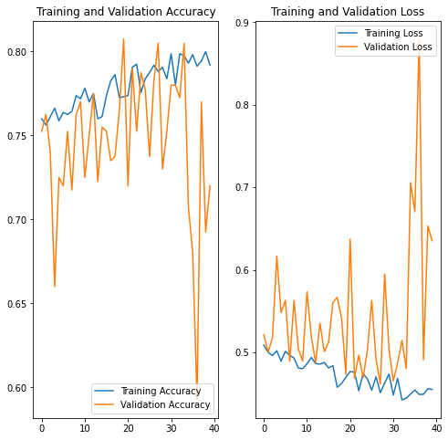

# Dogs-Vs-Wolves-Classification
Dogs vs Wolves Classifier using Tensorflow and CNN

<h3>Colab link: <a href='https://colab.research.google.com/drive/12Tm2M_-Dd56YA66ijmcHjdB1i2JZKE-F?usp=sharing'>Open in Colab</a></h3>

<h2>Dataset</h2>
Use this command to download the dataset from Kaggle 


```
kaggle datasets download -d harishvutukuri/dogs-vs-wolves --force
```

More information on how to download Kaggle dataset can be found <a href="https://www.kaggle.com/general/74235">here</a>.


<h2>Model:</h2>


```
Model: "sequential_11"
_________________________________________________________________
Layer (type)                 Output Shape              Param #   
=================================================================
sequential_5 (Sequential)    (None, 300, 300, 3)       0         
_________________________________________________________________
rescaling_1 (Rescaling)      (None, 300, 300, 3)       0         
_________________________________________________________________
conv2d_39 (Conv2D)           (None, 300, 300, 64)      1792      
_________________________________________________________________
max_pooling2d_39 (MaxPooling (None, 150, 150, 64)      0         
_________________________________________________________________
conv2d_40 (Conv2D)           (None, 150, 150, 32)      18464     
_________________________________________________________________
max_pooling2d_40 (MaxPooling (None, 75, 75, 32)        0         
_________________________________________________________________
conv2d_41 (Conv2D)           (None, 75, 75, 16)        4624      
_________________________________________________________________
max_pooling2d_41 (MaxPooling (None, 37, 37, 16)        0         
_________________________________________________________________
conv2d_42 (Conv2D)           (None, 37, 37, 16)        2320      
_________________________________________________________________
max_pooling2d_42 (MaxPooling (None, 18, 18, 16)        0         
_________________________________________________________________
dense_29 (Dense)             (None, 18, 18, 128)       2176      
_________________________________________________________________
conv2d_43 (Conv2D)           (None, 18, 18, 16)        18448     
_________________________________________________________________
max_pooling2d_43 (MaxPooling (None, 9, 9, 16)          0         
_________________________________________________________________
dropout_9 (Dropout)          (None, 9, 9, 16)          0         
_________________________________________________________________
batch_normalization_8 (Batch (None, 9, 9, 16)          64        
_________________________________________________________________
flatten_9 (Flatten)          (None, 1296)              0         
_________________________________________________________________
dense_30 (Dense)             (None, 128)               166016    
_________________________________________________________________
dense_31 (Dense)             (None, 2)                 258       
=================================================================
Total params: 214,162
Trainable params: 214,130
Non-trainable params: 32
_________________________________________________________________

```

<h2>Final epoch result:</h2>

```
Epoch 40/40
50/50 [==============================] - 6s 121ms/step - loss: 0.4551 - accuracy: 0.7919 - val_loss: 0.6353 - val_accuracy: 0.7200
```

<h2>Result after training:</h2>

<h3>Graph Looks pretty weird now, but still it predicts siberan Husky(which actually looks like a wolf) as dog and unseen rare wolves as wolf. So the model is doing pretty good!</h3>
